# AI应用板块财经舆情监测大屏

> 从0到1设计并开发的财经舆情可视化产品，覆盖**监测、预警、报告、处置**全生命周期。

## 一、产品定位与设计观念

本项目面向 **A股AI应用概念板块**，聚焦 AI Agent、AIGC创意营销、AI游戏、AI传媒 四条新兴主线，解决投资者在面对海量股吧舆情时信息分散、热点滞后、情绪难以量化的痛点。

**核心产品观念：**
- **从“人找信息”到“信息找人”**：自动采集东方财富股吧评论，替代人工刷屏。
- **从“定性感受”到“定量指数”**：通过NLP情感分析把舆情转化为可比较、可追踪的情绪指数。
- **从“单点看板”到“四层闭环”**：监测 → 预警 → 报告 → 处置，形成完整产品链路。
- **从“板块宏观”到“个股微观”**：支持板块、细分主线、个股三层下钻分析。

## 二、系统架构

系统采用 **数据层 → 算法层 → 应用层** 的三层架构：

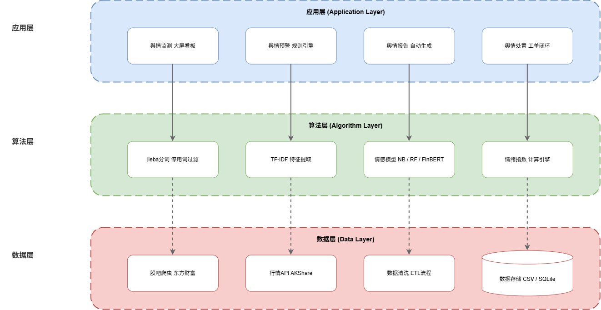

- **数据层**：东方财富股吧评论采集 + AKShare行情数据，CSV与模型文件存储。
- **算法层**：数据清洗、jieba分词、TF-IDF特征提取、情感分类模型、情绪指数聚合。
- **应用层**：Flask后端 + ECharts可视化大屏，支持今日/近7日/近30日时间筛选。

## 三、功能模块

产品围绕四大模块构建闭环：

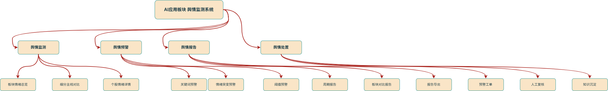

| 模块 | 核心子功能 | 说明 |
|------|-----------|------|
| 舆情监测 | 板块情绪总览、细分主线对比、个股情绪排行、热词云、舆情动态 | 实时/历史情绪指数可视化 |
| 舆情预警 | 关键词触发、情绪突变检测、趋势预判 | 基于规则引擎的预警推送 |
| 舆情报告 | 周期报告、板块对比、风险提示 | 日/周/月自动生成 |
| 舆情处置 | 工单生成、人工复核、标记归档 | 预警到处置闭环 |

## 四、数据流

从数据采集到最终展示，经历完整的处理链路：

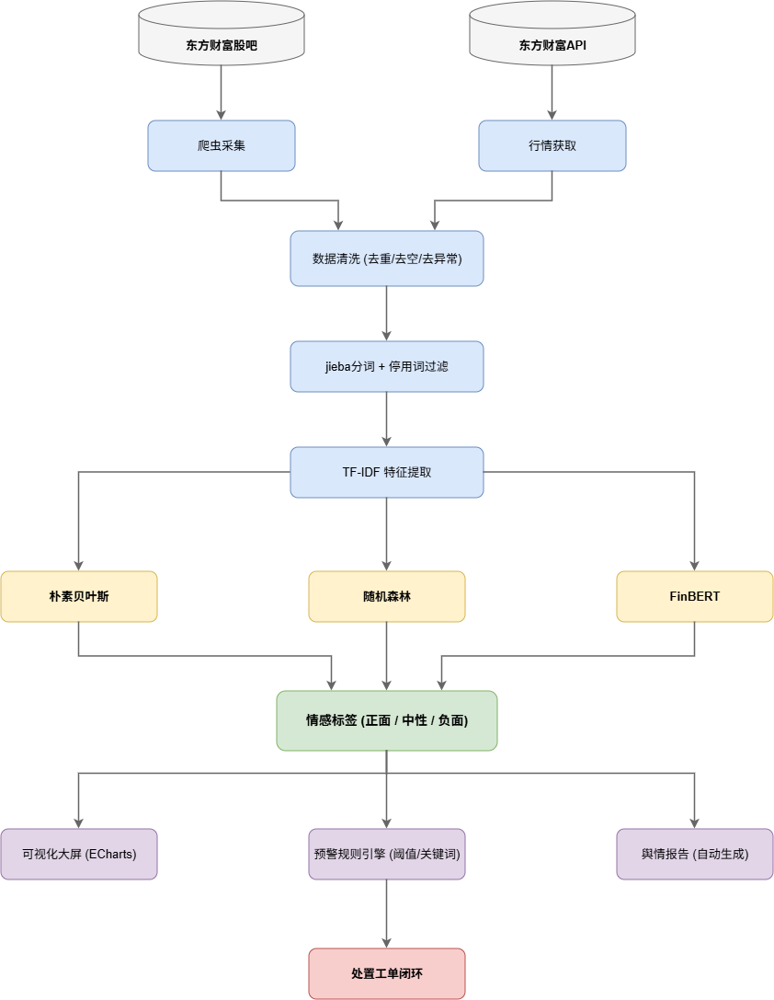

## 五、用例设计

系统主要服务于两类用户：投资者/分析师（查看舆情、接收预警、生成报告）和运营/管理员（配置规则、处理工单、维护数据）。

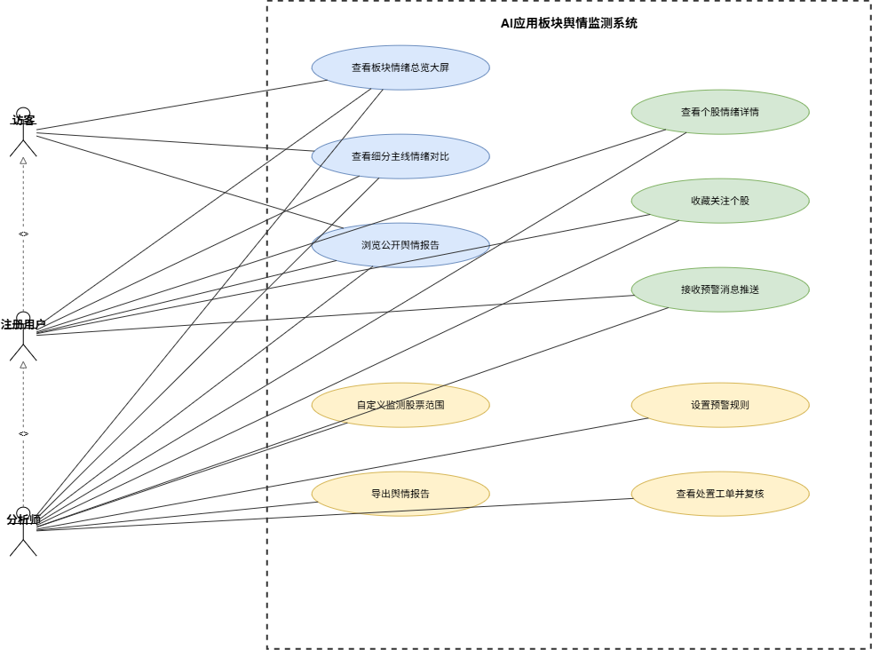

## 六、界面效果

### 6.1 大屏首页

首页采用冰蓝色主题，包含七大功能区域：板块情绪仪表盘、正负面占比环形图、热词云、细分主线情绪对比、个股情绪排行、舆情热度趋势、重点舆情动态。

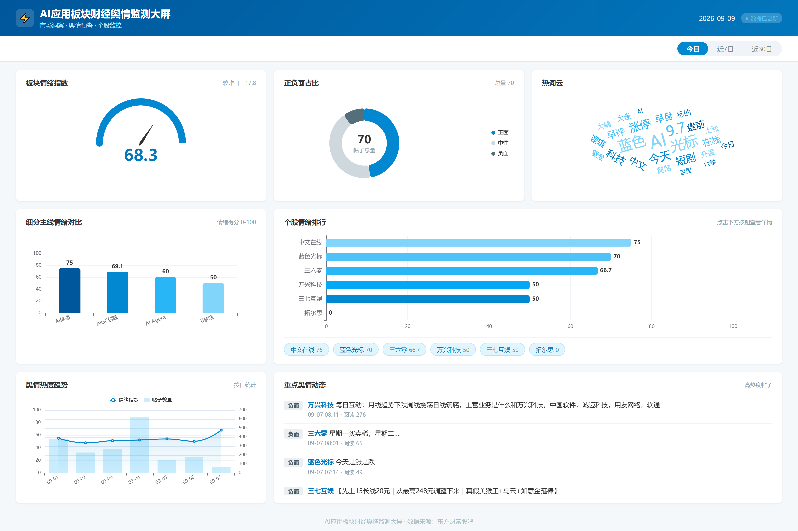

### 6.2 个股详情页

个股详情页与大屏保持统一风格，展示该股情绪指数、情绪趋势、帖子列表、舆情热度等维度。

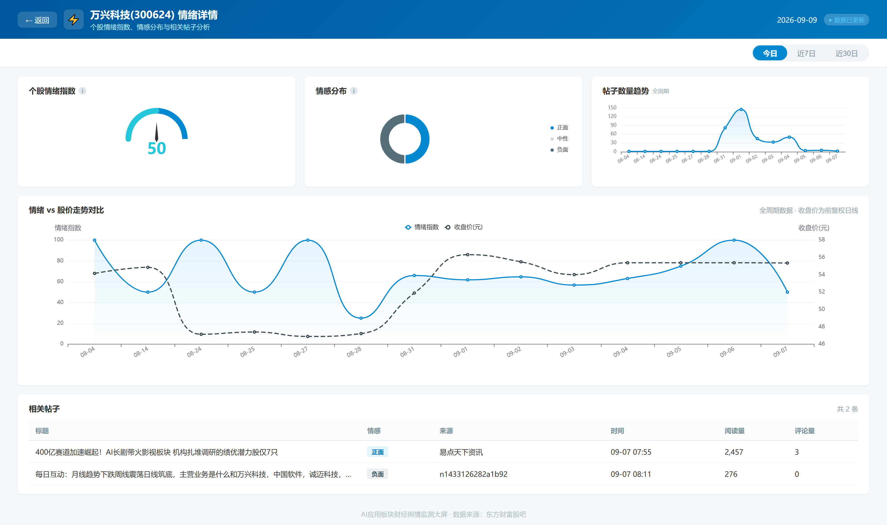

## 七、关键算法与模型效果

### 7.1 模型对比

对清洗后的2,312条有效帖子，分别训练 FinBERT、朴素贝叶斯、随机森林三种模型，采用 GridSearchCV 超参数调优与5折交叉验证。

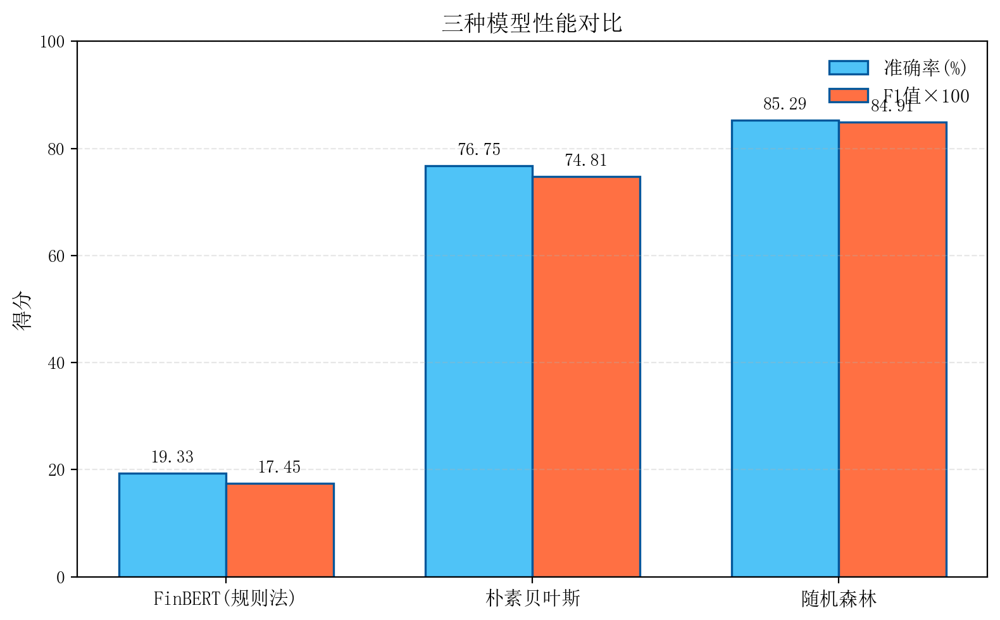

### 7.2 随机森林混淆矩阵

随机森林模型综合效果最优，准确率达85.29%，F1值0.8491。

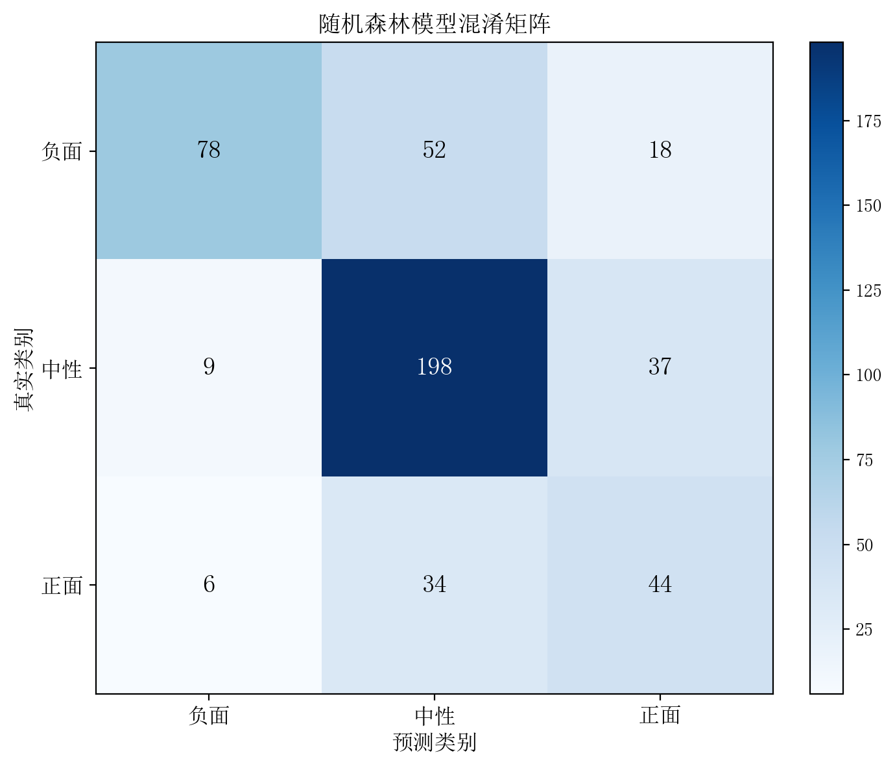

### 7.3 特征重要性

"涨停"、"主力"、"业绩"、"利好"等词语对情感分类贡献最大，符合股吧文本特点。

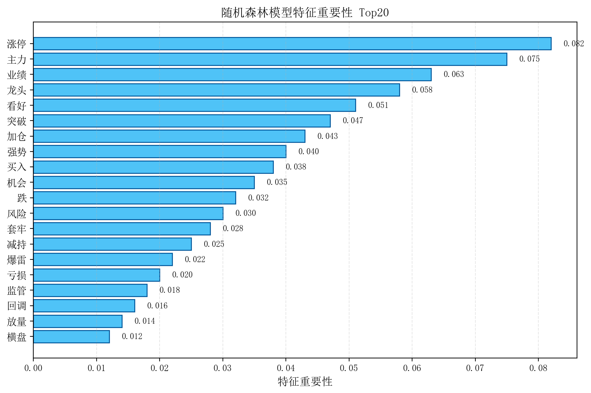

### 7.4 情绪指数分析

基于最优模型输出板块、细分主线、个股三层情绪指数：

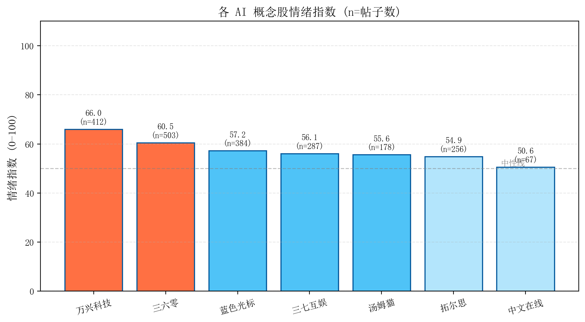

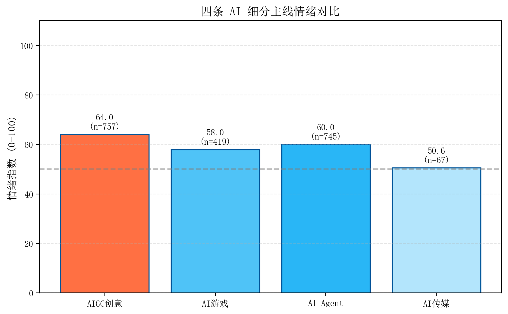

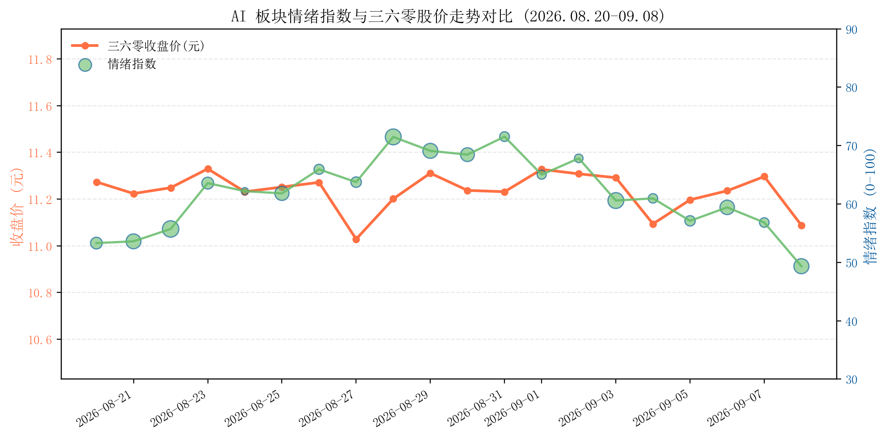

## 八、技术栈

- **数据采集**：Python 爬虫（东方财富股吧）、AKShare（行情数据）
- **数据清洗**：Pandas、正则规则去重/去水帖/去偏题帖
- **自然语言处理**：jieba 分词、TF-IDF 特征提取、随机森林情感分类
- **模型训练**：Scikit-learn、GridSearchCV、5折交叉验证
- **可视化**：ECharts（大屏）、Matplotlib（论文图表）
- **后端框架**：Flask
- **前端技术**：HTML / CSS / JavaScript

## 九、项目结构

```
ai-sentiment-dashboard/
├── crawler/              # 数据采集模块
│   ├── stock_bar_crawler.py   # 股吧评论爬虫
│   ├── recrawl_filtered.py    # 补充采集与过滤
│   └── test_*.py              # 数据源测试
├── nlp/                  # NLP与模型模块
│   ├── clean_data.py          # 数据清洗
│   ├── deploy_model.py        # 随机森林训练与预测
│   ├── model_comparison.py    # 模型对比实验
│   └── preprocessing.py       # 分词与预处理
├── analysis/             # 数据分析模块
├── alert/                # 预警规则引擎
├── dashboard/            # 可视化大屏
│   ├── templates/             # HTML模板
│   ├── static/                # 静态资源
│   └── app.py                 # Flask后端入口
├── data/                 # 数据与模型文件
│   ├── final_data_v3.csv      # 清洗并标注后的有效数据
│   ├── rf_model.pkl           # 随机森林模型
│   ├── tfidf_vectorizer.pkl   # TF-IDF向量化器
│   └── ...
├── docs/                 # 文档与图片
│   ├── diagrams/              # 系统架构/功能模块/数据流/用例图
│   ├── figs/                  # 大屏截图与模型图表
│   └── PRD.md                 # 产品需求文档
├── figures/              # 论文补充图表
├── requirements.txt
└── README.md
```

## 十、快速开始

```bash
# 安装依赖
pip install -r requirements.txt

# 启动可视化大屏
cd dashboard
python app.py
```

打开浏览器访问 `http://127.0.0.1:5000` 即可查看大屏。

## 十一、产品设计文档

详见 [docs/PRD.md](docs/PRD.md)。
